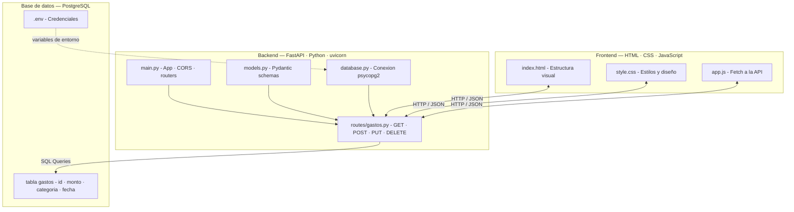

# 💰 Gestor de Gastos Personales

API REST para registrar y gestionar gastos personales, con frontend en HTML/CSS/JS.


---

## 🚀 Tecnologías

- **Backend:** Python · FastAPI · uvicorn
- **Base de datos:** PostgreSQL · psycopg2
- **Frontend:** HTML · CSS · JavaScript vanilla
- **Otros:** python-dotenv · Pydantic

---

## 📁 Estructura del proyecto

```
gestor-gastos/
├── backend/
│   ├── main.py          # Entrada de la app FastAPI
│   ├── database.py      # Conexión a PostgreSQL
│   ├── models.py        # Schemas Pydantic
│   └── routes/
│       └── gastos.py    # Endpoints CRUD
├── frontend/
│   ├── index.html       # Interfaz de usuario
│   ├── style.css        # Estilos
│   └── app.js           # Lógica y fetch a la API
|
├── .gitignore
└── README.md
```

---

## 🗄️ Base de datos

```sql
CREATE TABLE gastos (
    id SERIAL PRIMARY KEY,
    descripcion VARCHAR(255) NOT NULL,
    monto DECIMAL(10, 2) NOT NULL,
    categoria VARCHAR(100) NOT NULL,
    fecha DATE NOT NULL,
    created_at TIMESTAMP DEFAULT CURRENT_TIMESTAMP
);
```

---

## 🔌 Endpoints

| Método | Ruta | Descripción |
|--------|------|-------------|
| GET | `/gastos` | Obtener todos los gastos |
| GET | `/gastos?mes=6&anio=2026` | Filtrar por mes y año |
| POST | `/gastos` | Crear un gasto nuevo |
| PUT | `/gastos/{id}` | Actualizar un gasto |
| DELETE | `/gastos/{id}` | Eliminar un gasto |
| GET | `/gastos/resumen` | Resumen del mes actual |

Documentación interactiva disponible en `http://127.0.0.1:8000/docs`

---

## 🏗️ Arquitectura



---

## ⚙️ Instalación y uso

### 1. Clonar el repositorio

```bash
git clone https://github.com/GustavoRodriguez79/gestor-gastos.git
cd gestor-gastos
```

### 2. Crear entorno virtual e instalar dependencias

```bash
python -m venv venv
source venv/Scripts/activate  # Windows
pip install fastapi uvicorn psycopg2-binary python-dotenv
```

### 3. Configurar variables de entorno

Crear un archivo `backend/.env` con tus credenciales:

```
DB_HOST=localhost
DB_PORT=5432
DB_NAME=gestor_gastos
DB_USER=postgres
DB_PASSWORD=tu_contraseña
```

### 4. Crear la base de datos

Ejecutar el SQL de la sección Base de datos en pgAdmin.

### 5. Correr el servidor

```bash
cd backend
uvicorn main:app --reload
```

---

## 👤 Autor

**Gustavo Rodriguez**  
Tecnicatura Universitaria en Programación — UTN San Rafael  
[GitHub](https://github.com/GustavoRodriguez79)